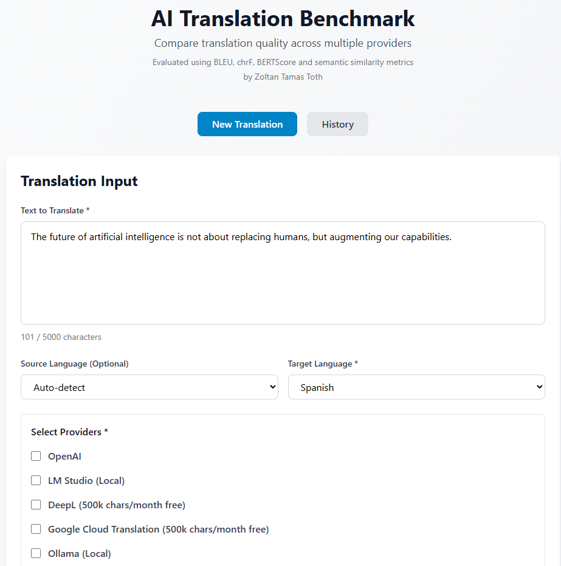
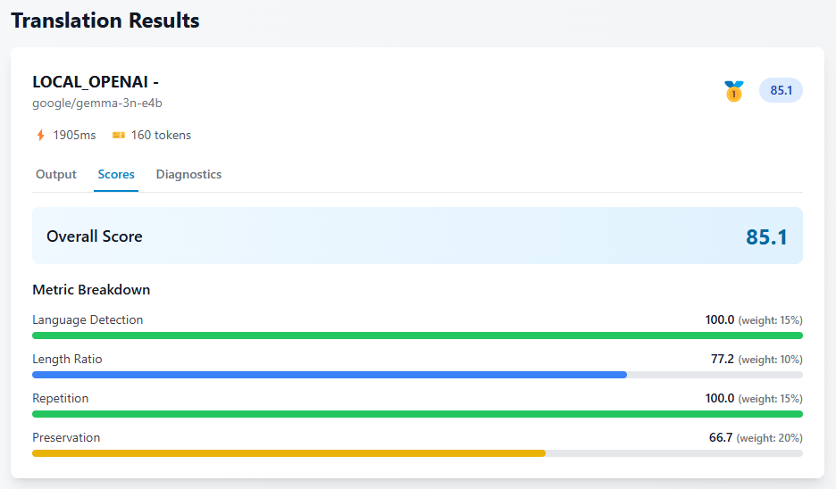
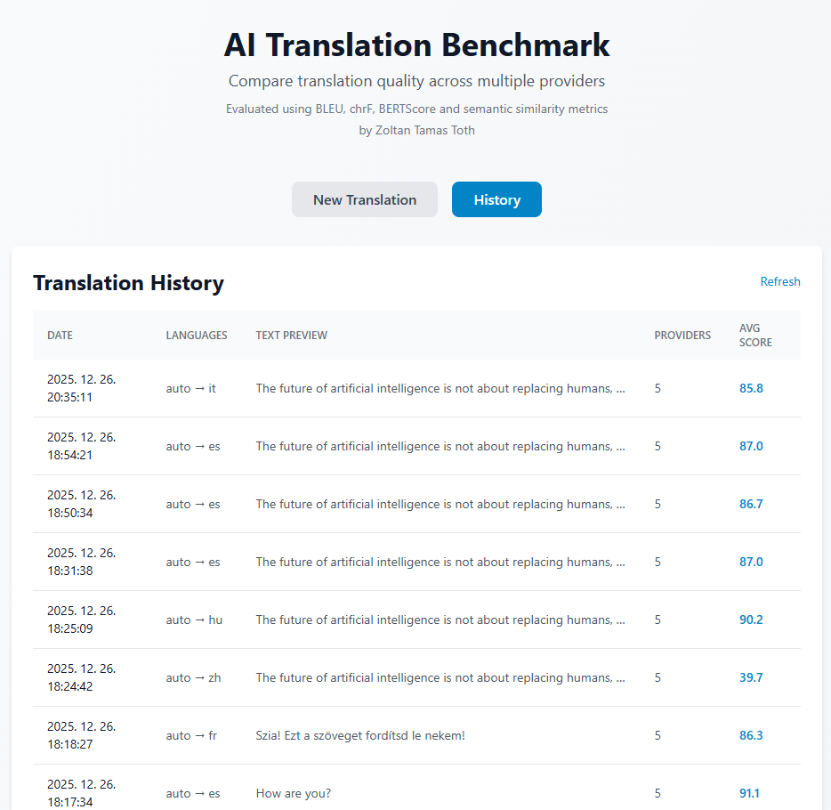

# AI Translation Benchmark

**Author:** Zoltan Tamas Toth  
**Date:** 2025-12-25

A comprehensive platform for evaluating AI translation quality across multiple providers with advanced metrics and quality estimation.

## Features

- **5 Translation Providers**: OpenAI, LM Studio, DeepL, Google Cloud Translation, and Ollama
- **Translation History**: View and review all past translation runs
- **Advanced Evaluation**: Reference-based and reference-free metrics
- **15 Languages**: English, Spanish, French, German, Italian, Portuguese, Chinese, Japanese, Korean, Russian, Arabic, Hindi, Hungarian, Vietnamese, Thai
- **5000 Character Limit**: Translate longer texts
- **Modern Web UI**: Clean, responsive interface with tab navigation
- **Extensible Architecture**: Easy to add new providers and metrics

## Screenshots

### Main Interface

*Translation input with multiple provider options*


*Translation results with quality scores and rankings*

### Translation History

*Browse and review past translation runs*

## Evaluation Methodology

The system evaluates translation quality using a multi-layered approach:

**Without Reference Translation:**
- Heuristic metrics: language detection, length ratio, repetition analysis, content preservation (numbers, punctuation)
- Semantic similarity: cross-lingual embeddings to measure meaning preservation

**With Reference Translation:**
- Statistical metrics: BLEU, chrF for lexical overlap
- Neural models: BERTScore for contextual similarity
- Cross-lingual embeddings: semantic meaning comparison

All metrics are weighted and combined into an overall quality score (0-100).

## Quick Start

### Prerequisites

- Python 3.11+
- Node.js 18+
- API keys (optional, depending on providers you want to use):
  - OpenAI API key
  - DeepL API key (500k chars/month free)
  - Google Cloud API key (500k chars/month free)

### Installation

**1. Clone the repository**
```bash
git clone https://github.com/yourusername/ai-translation-benchmark.git
cd ai-translation-benchmark
```

**2. Backend Setup**
```bash
cd backend
python -m venv venv

# Windows
venv\\Scripts\\activate

# Linux/Mac
source venv/bin/activate

# Install dependencies
pip install fastapi uvicorn sqlalchemy aiosqlite pydantic python-dotenv pyyaml
pip install openai deepl google-cloud-translate
pip install langdetect sentence-transformers torch
```

**3. Frontend Setup**
```bash
cd frontend
npm install
```

**4. Configuration**

Create a `.env` file in the backend directory (optional, for default API keys):
```bash
cd backend
cp .env.example .env
# Edit .env and add your API keys if desired
```

Copy the example configuration file:
```bash
# From project root
cp config.yaml.example backend/config.yaml
```

> **Note:** The `config.yaml` file must be in the `backend/` directory, not the project root.

Provider API keys can be entered directly in the UI, so the config file is mainly for application settings.

### Running the Application

**1. Start Backend**
```bash
cd backend
python -m uvicorn app.main:app --reload --host 0.0.0.0 --port 8000
```
Backend runs at `http://localhost:8000`

**2. Start Frontend** (new terminal)
```bash
cd frontend
npm run dev
```
Frontend runs at `http://localhost:5173`

**3. Open Browser**

Navigate to `http://localhost:5173`

## How to Use

### New Translation

1. Click the "New Translation" tab
2. Enter your text (up to 5000 characters)
3. Select target language
4. Choose providers and enter API keys:
   - **OpenAI**: Enter API key and select model (GPT-4, GPT-3.5)
   - **LM Studio**: Enter endpoint URL (models auto-load)
   - **DeepL**: Enter API key (free tier: 500k chars/month)
   - **Google Translate**: Enter API key (free tier: 500k chars/month)
   - **Ollama**: Enter endpoint URL (completely free, local)
5. Click "Run Translation"
6. View results with scores, rankings, and detailed metrics

### Translation History

1. Click the "History" tab
2. Browse all past translation runs
3. Click any row to see full details
4. Use pagination to navigate through results

## Supported Providers

| Provider | Type | Cost | Setup |
|----------|------|------|-------|
| **OpenAI** | Cloud | Paid | API key required |
| **LM Studio** | Local | Free | Local installation |
| **DeepL** | Cloud | Free tier | API key (500k/month free) |
| **Google Translate** | Cloud | Free tier | API key (500k/month free) |
| **Ollama** | Local | Free | Local installation |

## Architecture

```
Frontend (React + Vite)
        ↓ HTTP/REST
Backend (FastAPI)
        ↓
┌───────┼───────┬──────────┬──────────┐
│       │       │          │          │
OpenAI  LM     DeepL    Google    Ollama
        Studio           Translate
```

### Key Components

- **Provider Layer**: Extensible adapter pattern for translation services
- **Evaluation Engine**: Modular metric system with configurable weights
- **Database**: SQLite for run history and reproducibility
- **History View**: Browse and review past translations

## Project Structure

```
ai-translation-benchmark/
├── backend/
│   ├── app/
│   │   ├── api/          # API routes
│   │   ├── core/         # Config, constants
│   │   ├── db/           # Database models
│   │   ├── evaluation/   # Metrics engine
│   │   ├── providers/    # Translation providers
│   │   └── schemas/      # Data models
│   └── logs/             # Application logs
├── frontend/
│   └── src/
│       ├── components/   # React components
│       ├── api/          # API client
│       └── styles/       # CSS
└── config.yaml           # Configuration
```

## Configuration

### Provider Setup

Providers are configured via the UI. No need to edit config files for API keys.

### Metric Weights

Edit `config.yaml` to adjust metric weights:

```yaml
metrics:
  heuristics:
    language_detection:
      weight: 0.15
  semantic:
    weight: 0.40
```

## Development

### Backend Tests
```bash
cd backend
pytest tests/ -v
```

### Frontend Build
```bash
cd frontend
npm run build
```

## License

MIT License

## Contributing

Contributions welcome! Please submit a Pull Request.

## Contact

**Zoltan Tamas Toth**

---

Built with FastAPI, React, and modern ML libraries.
